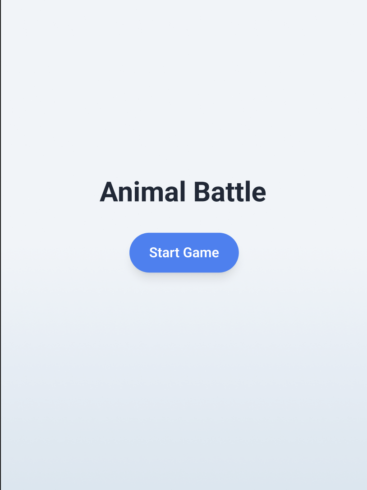
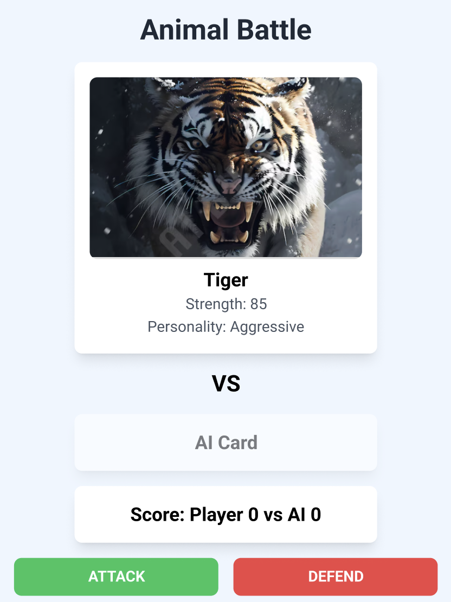
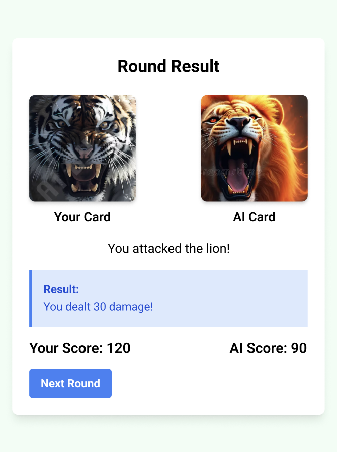
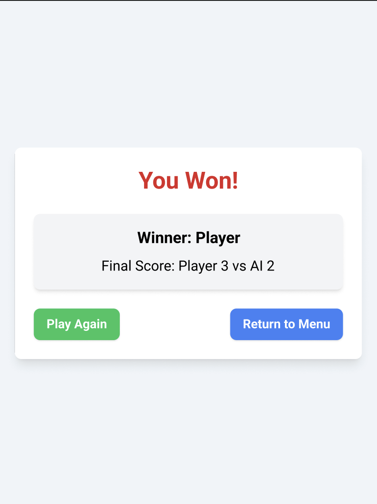
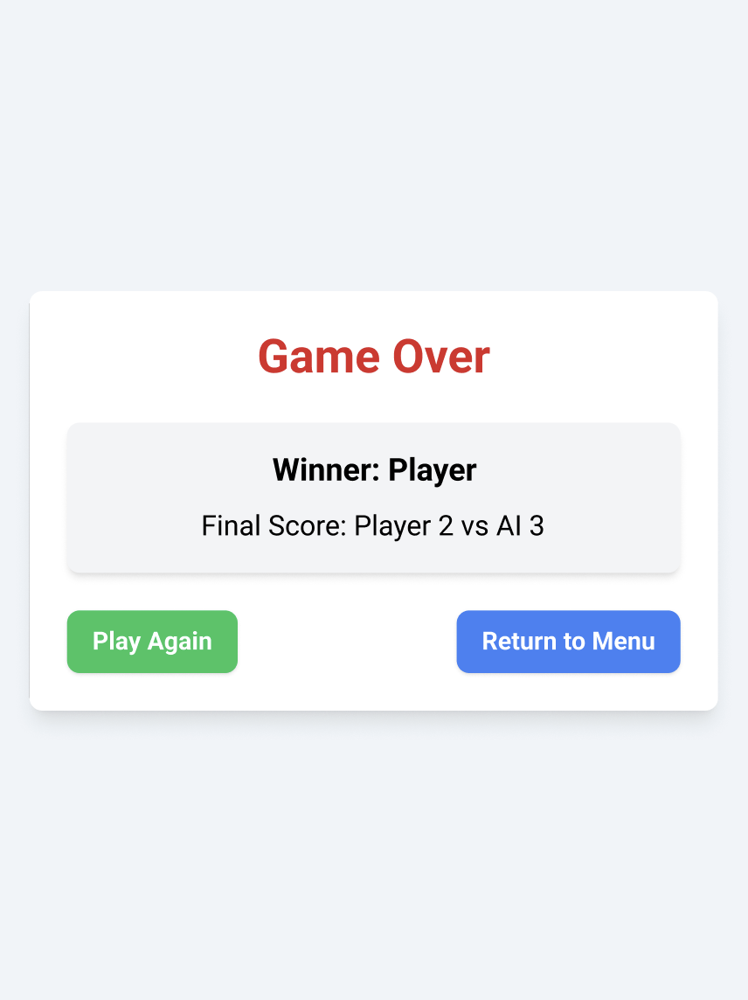

# 🐾 Animal Battle

Animal Battle är ett enkelt men unikt Android-kortspel utvecklat i **Kotlin**. Spelet är turbaserat och bygger på snabba dueller mellan spelaren och en AI där varje runda avgörs av vilket djurkort man drar och vilken handling man väljer.

---

## 🎯 Spelidé

Varje runda får både spelaren och AI:n varsitt djurkort.  
Varje kort har:

- **Namn**
- **Styrka**
- **Personlighet**

Spelaren väljer mellan:

- **Attack**
- **Defend**

Resultatet avgörs genom styrka + valda handlingar. Först till vald poäng vinner matchen.

---

## 🤖 AI – Personality System

AI:n använder ett enkelt personlighetssystem för att göra spelet mer varierat.

### 🟥 Aggressive
- Föredrar Attack
- Passar starka djur

### 🟦 Defensive
- Föredrar Defend
- Passar snabba / försiktiga djur

### 🟩 Random
- Gör helt slumpmässiga val

---

## 🐗 Exempel på djurkort

**🧸 Björn**
- Styrka: Hög
- Personlighet: Aggressive

**🐇 Hare**
- Styrka: Låg
- Personlighet: Defensive

**🦝 Tvättbjörn**
- Styrka: Medel
- Personlighet: Random

Bilder läggs i `res/drawable/`.

---

## 📱 UI – Skiss / Struktur

### 🏁 Startskärm
- Titel: *Animal Battle*
- Knapp: **Start Game**

### ⚔️ Spelskärm
- Spelarens kort (bild, namn, styrka, personlighet)
- AI:s kort (dolt tills rundan avslutas)
- Knappar: **Attack** / **Defend**
- Poängställning
- Resultattext (t.ex. *You won the round!*)

### 🎯 Round Result
- Visar båda korten
- Visar valda handlingar
- Visar resultatet
- Knapp: **Next Round**

### 🏆 You Won / 💀 Game Over
- Rubrik ändras beroende på om spelaren vann eller förlorade
- Visar slutpoäng
- Knapp: **Play Again**
- Knapp: **Return to Menu**

---

## 🎨 UI Design Preview

### 🏁 Start Screen


### ⚔️ Gameplay Screen


### 🎯 Round Result Screen


### 🟢 You Won Screen


### 🔴 Game Over Screen


---

## 🧩 Appens Struktur (Navigation Flow)

```
MainActivity  (Start Screen)
 └── GameActivity  (Gameplay)
        ├── RoundResultActivity  (Runda-resultat)
        │       └── Tillbaka till GameActivity
        └── GameOverActivity  (Slutresultat)
                ├── Play Again → GameActivity
                └── Return to Menu → MainActivity
```

---

## 🗂️ Projektstruktur (Filer och mappar)

```
app/
 ├── java/
 │    └── com.example.animalbattle/
 │           ├── MainActivity.kt
 │           ├── GameActivity.kt
 │           ├── RoundResultActivity.kt
 │           ├── GameOverActivity.kt
 │           │
 │           ├── data/
 │           │      ├── AnimalCard.kt
 │           │      ├── Deck.kt
 │           │      └── Personality.kt
 │           │
 │           ├── logic/
 │           │      ├── AiLogic.kt
 │           │      └── GameLogic.kt
 │           │
 │           └── util/
 │                  └── ScoreManager.kt
 │
 ├── res/
 │    ├── layout/
 │    │      ├── activity_main.xml
 │    │      ├── activity_game.xml
 │    │      ├── activity_round_result.xml
 │    │      └── activity_game_over.xml
 │    │
 │    ├── drawable/
 │    │      ├── *.png (djurkort)
 │    │      └── card_back.png
 │    │
 │    └── values/
 │           ├── colors.xml
 │           ├── styles.xml
 │           └── strings.xml
 │
 └── AndroidManifest.xml
```
